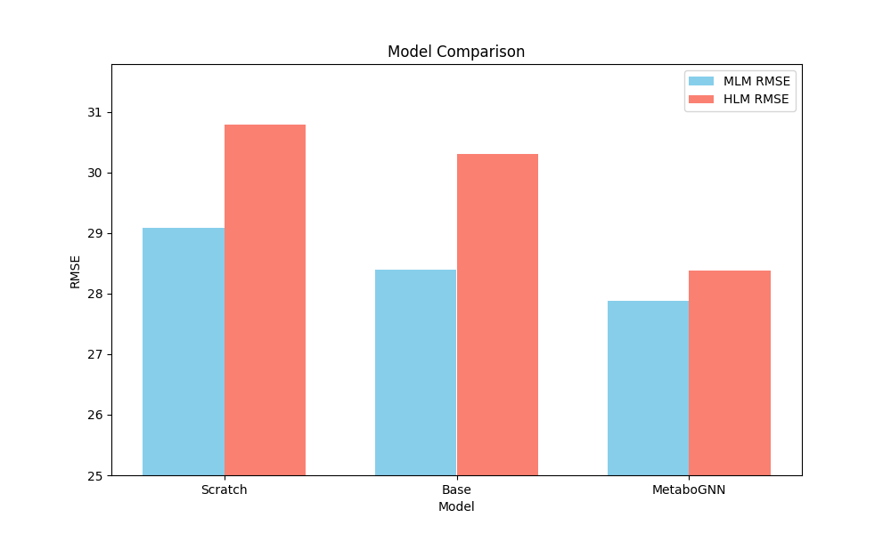

# MetaboGNN

MetaboGNN is a Graph Neural Network-based framework for predicting liver metabolic stability using molecular graph representations and cross-species experimental data.

This code was developed as part of our study:  
**"MetaboGNN: Predicting Liver Metabolic Stability with Graph Neural Networks and Cross-Species Data"**  
(submitted to *Journal of Cheminformatics*)

---

## 📦 Installation

This project is tested and recommended to run on Ubuntu (Linux) environments with Python 3.9+ and GPU support.

```bash
git clone https://github.com/qwon135/MetaboGNN.git
cd MetaboGNN
```
### ⚠️ CUDA Runtime Requirement

This project uses PyTorch with GPU acceleration, and requires:

- ✅ NVIDIA GPU (with at least 6–8GB VRAM recommended)
- ✅ Driver version ≥ 520 (supports CUDA 11.8)
- ✅ CUDA 11.8 Runtime

💡 Our experiments typically use 4–6GB of VRAM, but for stable training and inference, we recommend using a GPU with at least 8GB VRAM.

You do not need to install the full CUDA Toolkit — the runtime only is enough.

✅ You can check your driver version with:
```bash
nvidia-smi
```

### 🔗 Download CUDA 11.8 Runtime:
If `nvidia-smi` does not work or your driver is outdated, install the latest version here:
👉 https://developer.nvidia.com/cuda-11-8-0-download-archive

### 🧪 Environment Setup (with conda)
If you are using conda:

```bash
conda create -n metabo_gnn python=3.9
conda activate metabo_gnn

# Install PyTorch 2.1 + CUDA 11.8
conda install pytorch==2.1.2 pytorch-cuda=11.8 -c pytorch -c nvidia

# Install DGL with CUDA 11.8
conda install -c dglteam/label/th21_cu118 dgl

# Install PyTorch Geometric (PyG)
conda install conda-forge::pytorch_geometric
conda install pytorch-scatter=2.1.2 -c pyg
conda install pytorch-sparse=0.6.18 -c pyg

# 📝 Note:
# Make sure the CUDA versions match across PyTorch, DGL, and PyG.
# If any installation fails, try upgrading pip & setuptools:
# python -m pip install --upgrade pip setuptools
pip install -r requirements.txt
```

## Project Structure

```bash
MetaboGNN/
│
├── Benchmark/               # Baseline methods (e.g., MS_BACL, PredMS) from previous studies for performance comparison
├── data/                    # Dataset for liver metabolic stability prediction 
├── EdgeShaper/              # Utilities for bond-level interpretability and visualization
├── GraphCL/                 # Code for self-supervised pretraining 
├── modules/                 # Core GNN model components and training utilities
├── edgeshaper.ipynb         # Jupyter notebook to visualize bond-level model interpretation
├── train.py                 # Training GNN
├── requirements.txt         # Python dependencies
└── README.md                # Project documentation

```

## How to Run
### 1. Pretraining

The dataset used for pretraining is not included in this repository due to licensing constraints and file size. However, it can be downloaded from the following link:

📁 [Download pretraining dataset](https://drive.google.com/drive/folders/1Vowev9pZtRBFOXA_zCN9YTLO9ECIKEV7?usp=sharing)

Please download the data.parquet file from the provided link and place it inside the GraphCL/ directory as shown below:
We also provide a pretrained model checkpoint (`GraphCL/gnn_pretrain.pt`) for users who wish to skip this step.

To perform self-supervised pretraining from scratch, run:

```bash
PYTHONPATH=. python GraphCL/pretrain.py
```

### 2. Fine-tuning Experiments

We provide three fine-tuning scenarios for ablation and comparison:

🚀 Training the Models

```bash
python train.py --mode MetaboGNN # Main experiment: Fine-tuning pretrained GNN on cross-species metabolic stability task
python train.py --mode Scratch # Ablation: Training from scratch without pretraining for comparison
python train.py --mode Base # Representation-only: Evaluates pretrained GNN without cross-species fine-tuning
```
If you want to skip the training step and directly reproduce the inference results, you can download the pretrained model checkpoints from Google Drive:
🔗 [Download checkpoints (ckpt.zip)](https://drive.google.com/drive/folders/1Vowev9pZtRBFOXA_zCN9YTLO9ECIKEV7?usp=sharing)
Unzip ckpt.zip into the project root directory so that the following structure is maintained:

```bash
├── ckpt/
│   ├── 2025_MetaboGNN.pt
│   ├── 2025_Base.pt
│   └── 2025_Scratch.pt
```

📈 Evaluating Model Performance

After training, you can compare performance across the three models by running:

```bash
python infer.py

>> [   Scratch]  MLM RMSE: 29.09  |  HLM RMSE: 30.79
>> [      Base]  MLM RMSE: 28.39  |  HLM RMSE: 30.32
>> [ MetaboGNN]  MLM RMSE: 27.88  |  HLM RMSE: 28.39
```
This script loads the trained models (MetaboGNN, Base, and Scratch), evaluates them on a common test set, and generates a summary plot (Performance.png) that visualizes their performance.



### 3. Model Interpretability

We provide a Jupyter notebook that visualizes how the model interprets molecular structures, focusing on bond-level features.

- `edgeshaper.ipynb`: Highlights important chemical bonds based on attention weights or gradient-based signals.
  - Helps identify which bonds are most influential in predicting liver metabolic stability.
  - Requires a fine-tuned model (stored in the `ckpt/` directory).